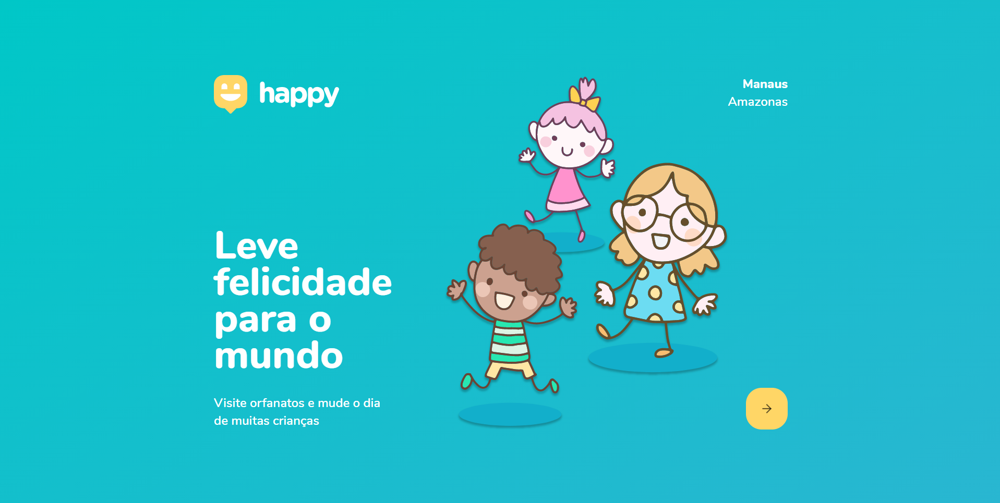

<h3 align="center">
    
</h3>
<h1 align="center">
    Happy
</h1>
<p align="center" style="width: 70%; margin: 20px auto;">
    This project was develop at Rocketseat's Next Level Week event during five days (10/12 to 10/16) about Children's day. Use it as you like, It is open-source :)
</p>

<h1 align="center">
    
</h1>

## Menu

- [Technologies](#-tecnhnologies)
- [How to use](#-how-to-use)

---

## 🚀 Technologies

This project was developed at Rocketseat's Next Level Week 3 event!

- [ReactJS](https://reactjs.org/)
- [React Leaflet](https://react-leaflet.js.org/)
- [Styled Components](https://styled-components.com/)

## 🚀️ Added features

- Implementation of the IBGE API on the web and mobile, disabling the button to navigate to the next page while the state and city are not selected
- Implementation of the `whatsapp` field in the api created with NodeJS, and integrating with the direct link to the Whatsapp app without a number registered in the orphanage
- Search the user's current location with lib `$ expo location`

## 🖥 How to use

You should have:

```
- Yarn or NPM
- NodeJS
```

Run this app in your computer following the steps below

```bash
# Clone this repository
$ git clone https://github.com/Possebas/happy-nlw3/tree/master/

# Enter on folder
$ cd happy-nlw3/web

# Then, install project's dependencies
$ yarn
# or
$ npm install

# Start application
$ yarn start
# or
$ npm start

# After that, a web page will be open on your main browser, enjoy!
```

This project was bootstrapped with [Create React App](https://github.com/facebook/create-react-app).
To learn React, check out the [React documentation](https://reactjs.org/).

## 📃 License

This project is under MIT license. Check file [LICENSE](LICENSE) for more details.

---

<h4 align="center">
    Developed with ❤️ by <b>Gustavo Possebon</b>
</h4>
